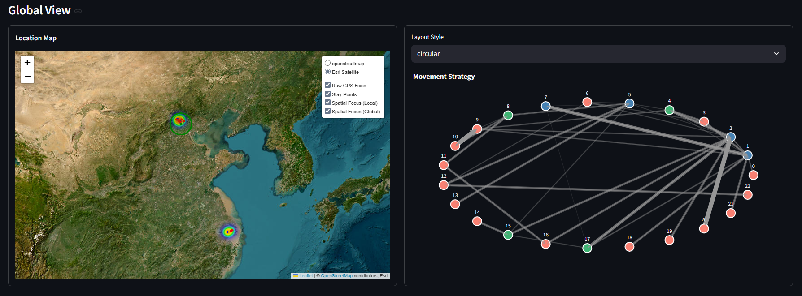
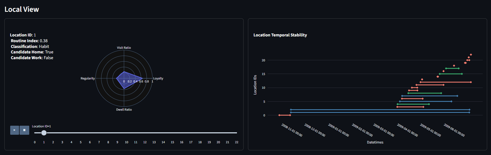
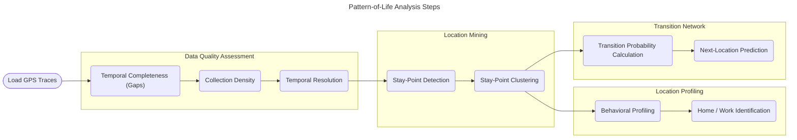

## Pattern-of-Life Analysis Toolkit

An individual-level analytics framework designed to expedite key steps in pattern-of-life analysis by:
- Assessing and visualizing the temporal quality of an individual's raw GPS fixes 
- Transforming raw GPS fixes into discrete, semantically-labeled locations
- Behaviorally profiling an individual's relationship with the semantically-labeled locations
- Modeling an individual's movement pattern to determine both the likelihood of a transition and the confidence in that assessment

## Table-of-Contents
- [Demo](#demo)
- [Key Features](#key-features)
- [Quick Start](#quick-start)
- [Data Source](#data-source)
- [Project Structure](#project-structure)
- [Workflow](#workflow)
- [Methods](#methods)
- [Citation](#citation)
- [License](#license)

## Demo
[Launch Demo](https://pattern-of-life-analysis.streamlit.app)

### Example Output (Taxonomy) 



[Return to TOC](#table-of-contents)

## Key Features

### Data Quality Assessment
- Temporal analyzer to evaluate raw GPS datasets temporal completeness, density/distribution, and resolution
- Spatial measurements for calculating radius of gyration, great circle distance, and center of mass

### Location Mining
- Custom Stay-Point detection
- Stay-Point clustering with DBSCAN 

### Location Profiling
- Configurable Anchor Point (Home / Work) identification
- Behavioral profiling based on temporal patterns
- Characterization of a user's spatial focus (sprawl) while at a location

### Location Transition Mapping
- First-order Markov Chain with Next-Location Prediction (see performance below)
- Evaluation metrics including baseline comparison and improvement calculation

### Performance
| User | Test States | Next-Step | Top-3  | Baseline | Improvement |
|------|-------------|-----------|--------|----------|-------------|
| 000  | 10          | 22.73%    | 43.18% | 30.00%   | +43.94%     |
| 003  | 18          | 18.75%    | 51.95% | 16.67%   | +211.72%    |
| 014  | 8           | 44.44%    | 50.00% | 37.50%   | +33.33%     |

[Return to TOC](#table-of-contents)

## Quick Start
### Install Package
```bash
git clone https://github.com/ShaneTeel/pattern-of-life-analysis.git
cd pattern-of-life-anlaysis

python -m pip install -r requirements.txt
```
### Example Usage
```python
import pickle
import numpy as np

from polkit.taxonomy import StayPointDetector, StayPointClusterer, LocationProfiler
from polkit.utils import get_logger, setup_logging

setup_logging(
    log_dir="../logs/polkit"
)

logger = get_logger(__name__)

# Declare source info
user_id = "014"
data_path = f"./app/data/user_{user_id}.pkl"

# Load Data
with open(data_path, "rb") as f:
    try:
        pfs = pickle.load(f)
        logger.debug(f"Sucessfully read .pkl file for user {user_id}.")    

    except FileNotFoundError as e:
        logger.debug(f"A FileNotFoundError occurred: {e}")

# Detect Stay-Points
detector = StayPointDetector()
sps = detector.detect(pfs)

# Cluster Stay-Points
clusterer = StayPointClusterer()
locs = clusterer.cluster(sps)

# Profile Locations
profiler = LocationProfiler()
profiles = profiler.profile(locs)

# View results
logger.info(f"Profiles DataFrame: \n{profiles}")
```
### Launch Dashboard

```python
streamlit run ./app/frontend.py
```

[Return to TOC](#table-of-contents)

## Data Source
This project uses the [GeoLife GPS Trajectories Dataset](https://www.microsoft.com/en-us/research/publication/geolife-gps-trajectory-dataset-user-guide/) published by Microsoft Research Group Asia for academic and research purposes. All data is anonymized and used in accordance with the dataset's intended research scope regarding human mobility analytics.

The techniques applied in the PoLKit package have legitimate applications in:
- Urban planning and transportation
- Public health modeling
- Location-based service development
- Academic mobility studies

This is a portfolio project to demonstrate technical skills in geospatial analysis, behavioral profiling, and predictive modeling.

## Project Structure
```
polkit/
|-- analyze/             # Spatial & Temporal Metrics
|-- strategy/            # First-Order Markov chain, Markov Evaluator
|-- taxonomy/            # Main profiling logic
│   |-- anchor_points/   # Home / Work Identifiers
│   |-- location_mining/ # Stay-Point Detection / Clustering
|-- utils/               # Logging, GeoLife .plt reader/pickler
|-- visualize/           # Visualizations (Plotly Charts, Folium Maps, NetworkX)
```

[Return to TOC](#table-of-contents)

## Workflow

### Pipeline Overview


[Return to TOC](#table-of-contents)

## Methods
### Loyalty Index

`Loyalty` measures the stability of a user's relationship with a location over time. 

$$\text{Loyalty}\left(\Delta{d}, h, n\right)=\frac{3}{\Large\frac{1}{D_{rec}\left(\Delta d\right)}+\frac{1}{S_{\text{dur, hr}}\left(h\right)}+\frac{1}{S_{\text{vis}}\left(v\right)}}$$

`Loyalty` addresses the following hypotheticals:

- Scenario 1: A user once lived at 12345 Old Home Address and as such, Old Home Address has a high visit count. However, three-months ago the user moved to 67901 New Home Address. 90-days have passed since the user lived at Old Home Address. In this scenario, the system attenutates a user's `Loyalty` to Location the Old Home to avoid a high-visit count misrepresenting the significance of the location.

- Scenario 2: A user recently started visiting a new gym in response to a promotion from the gym offering a 30-day free trial. The user's visits are all fairly recent (past 30-days), which could indicate a new habit. In this scenario, a few recent visits to a new location does not indicate a pattern. A user must visit a location beyond a specific threshold before a location's `Loyalty` score is amplified.

In short, neither the recency, nor the count, nor the total dwell should independently dictate the significance of a location. `Loyalty` aims to mitigate this issue.

A user's `Loyalty` to a location is influenced by three factors:

1. the number of days since the user's last visit (`Recency`)

$$D_{rec}(\Delta d) = e^{\large(\frac{\ln(0.5)}{\Delta{d_{1/2}}}\cdot{\normalsize\Delta{d}})}$$

$$\Delta{d_{1/2}} = {30}\text{ days }\text{(default value)}$$

2. the cumulative amount of time (in hours) spent at a location across all visits (`Depth`)

$$S_{dur}(h) = 1 - e^{\large(\frac{-\ln(2)}{h_{1/2}}\cdot{h})}$$

$$h_{1/2} = {4}\text{ hours }\text{(default value)}$$

3. the total number of visits to a location (`Visit Count`)

$$S_{vis}(v) = 1 - e^{\large(\frac{-\ln(2)}{v_{1/2}}\cdot{v})}$$

$$v_{1/2} = {10}\text{ visits }\text{(default value)}$$

### Loyalty Label

**Anchor (top rating)** - The location represents the center of gravity for a User's movements. Home is typically an anchor. However, data quality will ultimately affect classification.

**Habit (2nd best)** - The user's relationship with the location represents an established habit (work, the coffee shop someone visits every day prior to work or the gym someone visits every day after work).

**Recurring (3rd best)** - User visits the location frequently, but the visits lack a routine (a grocery store, the movies, etc.). It, like all the other two above, is a destination, but it's not one with an established routine (i.e., why it's not a habit).

**Transient (worst)** - Either not a destination (i.e., a way-point) or a location that lacks enough history to be qualified for any other class (Transient == Outlier).

### Predictability Index
`Predictability` is a measure of consistency across three vectors:
1. Arrival hour
2. Dwell Time (in hours)
3. Gaps (in days) between visits

The formula for measuring consistency (below) is normalized to a range of [0, 1] with 1 == absolute consistency and 0 == no consistency. The function returns 0 for a specific vector if the location has less that two visits or there are less than two measured gaps between visits.

$$P(x) = {\frac{1}{\large\frac{\max({x}) - \min({x})}{\mu({x})}}}$$

[Return to TOC](#table-of-contents)

## Citation

If you use this package or software, please cite it as follows:

```bibtex
@misc{ShaneTeel2026,
    author = {Shane Teel},
    title = {Pattern-of-Life Analysis},
    howpublished = {\url{https://github.com/ShaneTeel/pattern-of-life-analysis}},
    year = {2026},
    note = {Version 0.1.0, accessed February 11, 2026}}
```

[Return to TOC](#table-of-contents)

## License

This project is licensed under the term of the [GNU General Public License v3.0](./LICENSE)

**Copyright (c) 2026 Shane Teel**

[Return to TOC](#table-of-contents)